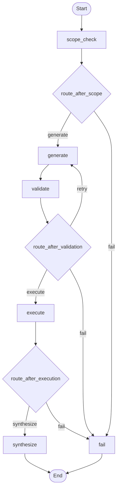

# 🏨 Hotel Bookings NL2SQL Agent

An AI-powered Natural Language to SQL solution that lets business users ask plain-English questions about hotel bookings and get meaningful answers from the underlying database — no SQL knowledge required.

Built with **LangGraph**, **LangChain**, and **Claude Haiku 4.5**, backed by a **SQLite** database of Indian hotel bookings (2025–2026), with a **React + TypeScript** frontend.

---

## Demo

> *"How many bookings did we receive from each region during August 2026?"*

**Agent:** During August 2026, the West region led with 1,257 bookings, followed by the North region with 1,224 bookings. The South, Central, and East regions received 1,178, 1,025, and 1,016 bookings respectively.

---

## Architecture

```
User Question (Natural Language)
         │
         ▼
  ┌─────────────┐
  │ scope_check │  ← Blocklist: rejects off-topic & injection attempts
  └──────┬──────┘
         │
         ▼
  ┌─────────────┐
  │ generate_sql│  ← Claude Haiku: schema context + few-shot prompting
  └──────┬──────┘
         │
         ▼
  ┌─────────────┐
  │ validate_sql│  ← sqlglot: syntax check + blocked keywords (DROP, DELETE...)
  └──────┬──────┘
         │ fail → retry (max 2) → fail_node
         ▼
  ┌─────────────┐
  │ execute_sql │  ← SQLite: runs against hotel_bookings_100k.db
  └──────┬──────┘
         │
         ▼
  ┌─────────────┐
  │  synthesize │  ← Claude Haiku: narrates results in plain English (INR, crore/lakh)
  └──────┬──────┘
         │
         ▼
    Final Answer
```

**FastAPI** wraps the agent and serves the **React/TypeScript** frontend at `localhost:5173`.

---
Execution flow


---
## Industry Best Practices Applied

| Practice | Implementation |
|---|---|
| **Schema context injection** | Full table definitions + column descriptions injected into every prompt |
| **Few-shot prompting** | 6 worked Q→SQL examples teach the LLM your schema patterns |
| **SQL validation before execution** | sqlglot catches syntax errors; blocked keywords prevent write operations |
| **Self-correction retry loop** | Failed SQL sent back to LLM with error context; max 2 retries |
| **Scope guard** | Keyword blocklist rejects off-topic questions before any LLM call |
| **Prompt injection protection** | Injection phrase detection layer before SQL generation |
| **Result synthesis** | LLM narrates raw SQL results in business-friendly language |
| **Observability** | LangSmith tracing — every run logged with node latency and token counts |
| **Eval framework** | 30 test cases across 9 categories; 92.5% pass rate on 100k row DB |

---

## Schema

```
regions   → 5 Indian regions (North, South, East, West, Central)
hotels    → 28 hotels across India (2–5 star, Budget to Luxury)
customers → 1,000 customers with loyalty tiers (Bronze → Platinum)
bookings  → 100,000 bookings with room type, channel, status, revenue (INR)
```

Data spans **2025–2026** with realistic seasonality — peak in Oct–Nov (festive), August surge, monsoon dip in June–July.

---

## Sample Questions

| # | Question | Tests |
|---|---|---|
| 1 | How many bookings from each region in August 2026? | Basic aggregation + date filter |
| 2 | What is the average booking value by hotel star rating? | GROUP BY + AVG |
| 3 | Show the top 5 hotels by revenue in 2026 | ORDER BY + LIMIT |
| 4 | Which region has the highest cancellation rate? | CASE WHEN + percentage |
| 5 | For each region, which hotel performs best by revenue? | Correlated subquery |
| 6 | Which customers booked in both 2025 and 2026? | Cohort / retention query |
| 7 | What is the month-over-month growth in 2026? | LAG() window function |
| 8 | Hotels with above-average revenue — most common room type? | Subquery + join |
| 9 | Compare Q1 2025 vs Q1 2026 revenue growth | Quarter definition + YoY % |
| 10 | which regin has the highst canllation rat *(typos)* | Typo resilience |

---

## Setup

### Backend

```bash
# 1. Clone
git clone https://github.com/kattisrihari/nl-to-sql-quest.git
cd nl-to-sql-quest

# 2. Install Python dependencies
pip install -r requirements.txt

# 3. Set up environment
cp .env.example .env
# Add your ANTHROPIC_API_KEY to .env

# 4. Generate the database (choose scale)
python data/seed.py           # 800 bookings — quick demo
python data/seed_large.py     # 10,000 bookings
python data/seed_100k.py      # 100,000 bookings (recommended)

# 5. Update DB path in src/agent/tools.py if using large/100k DB

# 6. Start the API server
uvicorn app:app --reload
# API runs at http://127.0.0.1:8000
# Docs at http://127.0.0.1:8000/docs
```

### Frontend

```bash
cd frontend
npm install
npm run dev
# UI runs at http://localhost:5173
```

---

## Eval Framework

```bash
# Run all 30 test cases
python run_evals.py

# Run a single category
python run_evals.py --category "Core Business"

# Run a single test
python run_evals.py --id TC01

# Validate test cases without running agent
python run_evals.py --dry-run
```

**Results: 24/30 passed (92.5%) on 100k row database**

| Category | Score |
|---|---|
| Core Business | 5/5 ✅ |
| Customer Analysis | 4/4 ✅ |
| Typo Resilience | 2/2 ✅ |
| Multi-step Reasoning | 3/4 |
| Date Logic | 3/4 |
| Ambiguous Queries | 2/3 |
| Scope Blocking | 2/3 |
| Prompt Injection | 2/3 |
| Edge Inputs | 1/2 |

---

## Tech Stack

| Layer | Technology |
|---|---|
| LLM | Claude Haiku 4.5 (Anthropic) |
| Agent framework | LangGraph + LangChain |
| SQL validation | sqlglot |
| Database | SQLite (100k rows, 16MB) |
| Backend API | FastAPI + Uvicorn |
| Frontend | React + TypeScript + Tailwind CSS |
| Observability | LangSmith tracing |
| Evals | Custom framework — 30 test cases |

---

## Project Structure

```
nl-to-sql-quest/
├── data/
│   ├── schema.sql          # 4-table schema definition
│   ├── seed.py             # 800 bookings (dev)
│   ├── seed_large.py       # 10,000 bookings
│   ├── seed_100k.py        # 100,000 bookings (prod)
│   └── verify.py           # Sanity check queries
├── src/agent/
│   ├── prompts.py          # Schema context + few-shot examples
│   ├── nodes.py            # LangGraph node functions
│   ├── graph.py            # Agent graph wiring
│   └── tools.py            # SQL validation + execution
├── evals/
│   ├── test_cases.py       # 30 test cases across 9 categories
│   └── evaluator.py        # Scoring engine
├── frontend/               # React + TypeScript UI
├── app.py                  # FastAPI server
├── run_evals.py            # Eval orchestrator
└── .env.example
```

---

## Known Limitations & Future Improvements

- **No conversation memory** — each query is stateless; follow-up questions lose context
- **SQLite only** — swap `DB_PATH` in `tools.py` to connect PostgreSQL/BigQuery for production
- **Hardcoded date context** — "this year" is hardcoded as 2026; needs dynamic date injection
- **Single LLM** — synthesis and generation both use Haiku; a larger model (Sonnet) improves complex query accuracy
- **Future: retrieval-augmented few-shots** — store successful Q→SQL pairs and inject the most similar ones dynamically

---

## License

MIT
